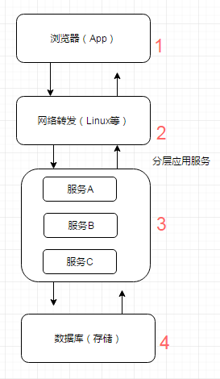
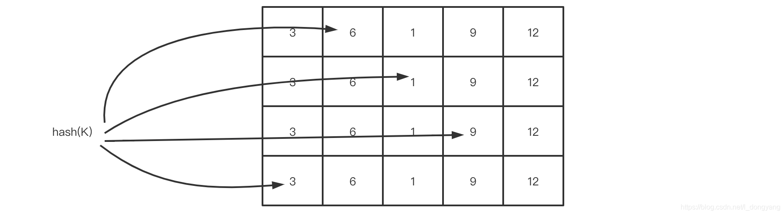
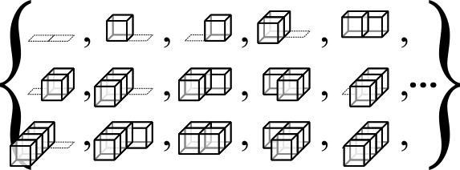
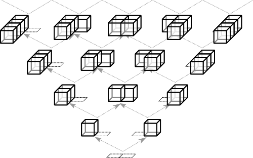
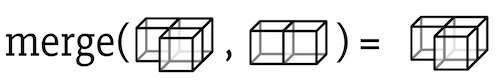
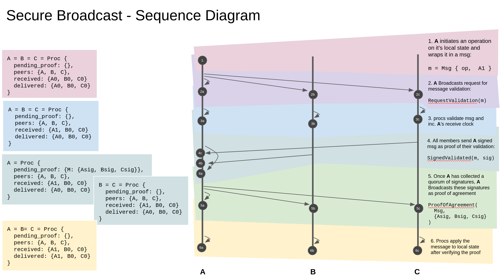
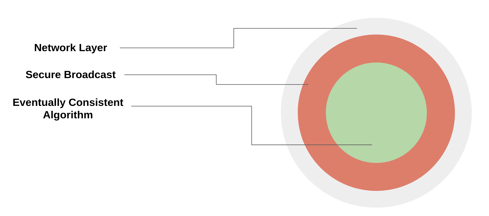

# OpenEuler 比赛-分布式缓存设计与实现

## 项目背景
随着5G、物联网、互联网各种云原生、等系统平台的演变，内容信息越来越复杂，用户数和访问量越来越大，我们的应用需要支撑更多的并发量，同时我们的应用服务器和数据库服务器所做的计算也越来越多。但是往往我们的应用服务器资源是有限的，且技术变革是缓慢的，数据库每秒能接受的请求次数也是有限的（或者文件的读写也是有限的），如何能够有效利用有限的资源来提供尽可能大的吞吐量？一个有效的办法就是引入缓存，打破标准流程，每个环节中请求可以从缓存中直接获取目标数据并返回，从而减少计算量，有效提升响应速度，让有限的资源服务更多的用户。





上述为缓存系统在整个系统生命周期中的应用，每个环节的缓存各有使用特点。

### 缓存算法背景

* FIFO(first in first out)先进先出策略，最先进入缓存的数据在缓存空间不够的情况下（超出最大元素限制）会被优先被清除掉，以腾出新的空间接受新的数据。策略算法主要比较缓存元素的创建时间。在数据实效性要求场景下可选择该类策略，优先保障最新数据可用。
* LFU(less frequently used)最少使用策略，无论是否过期，根据元素的被使用次数判断，清除使用次数较少的元素释放空间。策略算法主要比较元素的hitCount（命中次数）。在保证高频数据有效性场景下，可选择这类策略。
* LRU(least recently used)最近最少使用策略，无论是否过期，根据元素最后一次被使用的时间戳，清除最远使用时间戳的元素释放空间。策略算法主要比较元素最近一次被get使用时间。在热点数据场景下较适用，优先保证热点数据的有效性。
* LFU的局限性：在 LFU 中只要数据访问模式的概率分布随时间保持不变时，其命中率就能变得非常高。但是他的历史局部访问量太高，其他的数据根本无法淘汰历史数据，所以有局限性。
* LRU的优点和局限性：LRU可以很好的应对突发流量的情况，因为不需累计数据频率。但LRU会认为最后到的数据是最可能被再次访问的，从而给予最高的优先级。在许多负载之下，LRU依然需要更多的空间才能做到跟LFU一致的缓存命中率。

### 缓存机制

虽然从硬件介质上来看，无非就是内存和硬盘两种，但从技术上，可以分成内存、硬盘文件、数据库。

* 内存：将缓存存储于内存中是最快的选择，无需额外的I/O开销，但是内存的缺点是没有持久化落地物理磁盘，一旦应用异常break down而重新启动，数据很难或者无法复原。
* 硬盘：一般来说，很多缓存框架会结合使用内存和硬盘，在内存分配空间满了或是在异常的情况下，可以被动或主动的将内存空间数据持久化到硬盘中，达到释放空间或备份数据的目的。
* 数据库：前面有提到，增加缓存的策略的目的之一就是为了减少数据库的I/O压力。现在使用数据库做缓存介质是不是又回到了老问题上了？其实，数据库也有很多种类型，像那些不支持SQL，只是简单的key-value存储结构的特殊数据库（如BerkeleyDB和Redis），响应速度和吞吐量都远远高于我们常用的关系型数据库等。

### 缓存分类和应用场景
* 缓存有各类特征，而且有不同介质的区别，那么实际工程中我们怎么去对缓存分类呢？在目前的应用服务框架中，比较常见的，时根据缓存雨应用的藕合度，分为local cache（本地缓存）和remote cache（分布式缓存）：
    * 本地缓存：指的是在应用中的缓存组件，其最大的优点是应用和cache是在同一个进程内部，请求缓存非常快速，没有过多的网络开销等，在单应用不需要集群支持或者集群情况下各节点无需互相通知的场景下使用本地缓存较合适；同时，它的缺点也是应为缓存跟应用程序耦合，多个应用程序无法直接的共享缓存，各应用或集群的各节点都需要维护自己的单独缓存，对内存是一种浪费。
    * 分布式缓存：指的是与应用分离的缓存组件或服务，其最大的优点是自身就是一个独立的应用，与本地应用隔离，多个应用可直接的共享缓存。

> 目前各种类型的缓存都活跃在成千上万的应用服务中，还没有一种缓存方案可以解决一切的业务场景或数据类型，我们需要根据自身的特殊场景和背景，选择最适合的缓存方案。缓存的使用是程序员、架构师的必备技能，好的程序员能根据数据类型、业务场景来准确判断使用何种类型的缓存，如何使用这种缓存，以最小的成本最快的效率达到最优的目的。

### 本地缓存
* 个别场景下，我们只需要简单的缓存数据的功能，而无需关注更多存取、清空策略等深入的特性时，直接编程实现缓存则是最便捷和高效的。
    * 成员变量或局部变量实现
    * 静态变量实现
    > 业务中常用的基本信息判断，通过静态变量一次获取缓存内存中，减少频繁的I/O读取，静态变量实现类间可共享，进程内可共享，缓存的实时性稍差。为了解决本地缓存数据的实时性问题，目前大量使用的是结合ZooKeeper的自动发现机制，实时变更本地静态变量缓存。这类缓存实现，优点是能直接在heap区内读写，最快也最方便；缺点同样是受heap区域影响，缓存的数据量非常有限，同时缓存时间受GC影响。主要满足单机场景下的小数据量缓存需求，同时对缓存数据的变更无需太敏感感知，如上一般配置管理、基础静态数据等场景。
    
### 常用本地缓存

#### Ehcache
Ehcache是现在最流行的纯Java开源缓存框架，配置简单、结构清晰、功能强大，是一个非常轻量级的缓存实现。
Ehcache的核心定义主要包括：

1. cache manager：缓存管理器，以前是只允许单例的，不过现在也可以多实例了。
2. cache：缓存管理器内可以放置若干cache，存放数据的实质，所有cache都实现了Ehcache接口，这是一个真正使用的缓存实例；通过缓存管理器的模式，可以在单个应用中轻松隔离多个缓存实例，独立服务于不同业务场景需求，缓存数据物理隔离，同时需要时又可共享使用。
3. element：单条缓存数据的组成单位。
4. system of record（SOR）：可以取到真实数据的组件，可以是真正的业务逻辑、外部接口调用、存放真实数据的数据库等，缓存就是从SOR中读取或者写入到SOR中去的。

整个Ehcache提供了对JSR、JMX等的标准支持，能够较好的兼容和移植，同时对各类对象有较完善的监控管理机制。它的缓存介质涵盖堆内存（heap）、堆外内存和磁盘，各介质可独立设置属性和策略。Ehcache最初是独立的本地缓存框架组件，在后期的发展中，结合Terracotta服务阵列模型，可以支持分布式缓存集群，主要有RMI、JGroups、JMS和Cache Server等传播方式进行节点间通信。

整体数据流转包括这样几类行为:

Flush：缓存条目向低层次移动。
Fault：从低层拷贝一个对象到高层。在获取缓存的过程中，某一层发现自己的该缓存条目已经失效，就触发了Fault行为。
Eviction：把缓存条目除去。
Expiration：失效状态。
Pinning：强制缓存条目保持在某一层。

> Ehcache的超时设置主要是针对整个cache实例设置整体的超时策略，而没有较好的处理针对单独的key的个性的超时设置（有策略设置，但是比较复杂，就不描述了），因此，在使用中要注意过期失效的缓存元素无法被GC回收，时间越长缓存越多，内存占用也就越大，内存泄露的概率也越大。


#### Guava

Guava Cache是Google开源的一款缓存工具，其主要实现的缓存功能有：

* 自动将entry节点加载进缓存结构中；
* 当缓存的数据超过设置的最大值时，使用LRU算法移除；
* 具备根据entry节点上次被访问或者写入时间计算它的过期机制；
* 缓存的key被封装在WeakReference引用内；
* 缓存的Value被封装在WeakReference或SoftReference引用内；
* 统计缓存使用过程中命中率、异常率、未命中率等统计数据。
> Guava Cache的架构设计灵感来源于ConcurrentHashMap，我们前面也提到过，简单场景下可以自行编码通过hashmap来做少量数据的缓存，但是，如果结果可能随时间改变或者是希望存储的数据空间可控的话，自己实现这种数据结构还是有必要的。

### 常用分布式缓存

#### Memcached

memcached是应用较广的开源分布式缓存产品之一，它本身其实不提供分布式解决方案。在服务端,memcached集群环境实际就是一个个memcached服务器的堆积，环境搭建较为简单；cache的分布式主要是在客户端实现，通过客户端的路由处理来达到分布式解决方案的目的。客户端做路由的原理非常简单，应用服务器在每次存取某key的value时，通过某种算法把key映射到某台memcached服务器节点上，因此这个key所有操作都在这个节点上。

memcached客户端采用一致性hash算法作为路由策略，相对于一般hash（如简单取模）的算法，一致性hash算法除了计算key的hash值外，还会计算每个server对应的hash值，然后将这些hash值映射到一个有限的值域上（比如0~2^32）。通过寻找hash值大于hash(key)的最小server作为存储该key数据的目标server。如果找不到，则直接把具有最小hash值的server作为目标server。同时，一定程度上，解决了扩容问题，增加或删除单个节点，对于整个集群来说，不会有大的影响。最近版本，增加了虚拟节点的设计，进一步提升了可用性。

#### Redis

Redis是一个远程内存数据库，性能卓越，具有复制特性以及解决问题而生的独一无二的数据模型。它可以存储键值对与5种不同类型的值之间的映射，可以将存储在内存的键值对数据持久化到硬盘，可以使用复制特性来扩展读性能，还可以使用客户端分片来扩展写性能。

Redis内部使用一个redisObject对象来标识所有的key和value数据，redisObject最主要的信息如图所示：type代表一个value对象具体是何种数据类型，encoding是不同数据类型在Redis内部的存储方式，比如——type=string代表value存储的是一个普通字符串，那么对应的encoding可以是raw或是int，如果是int则代表世界Redis内部是按数值类型存储和表示这个字符串。

1. 对象的编码方式：字符串可以被编码为raw（一般字符串）或Rint（为了节约内存，Redis会将字符串表示的64位有符号整数编码为整数来进行储存）；列表可以被编码为ziplist或linkedlist，ziplist是为节约大小较小的列表空间而作的特殊表示；集合可以被编码为intset或者hashtable，intset是只储存数字的小集合的特殊表示；hash表可以编码为zipmap或者hashtable，zipmap是小hash表的特殊表示；有序集合可以被编码为ziplist或者skiplist格式，ziplist用于表示小的有序集合，而skiplist则用于表示任何大小的有序集合。

2. 从网络I/O模型上看，Redis使用单线程的I/O复用模型，自己封装了一个简单的AeEvent事件处理框架，主要实现了epoll、kqueue和select。对于单纯只有I/O操作来说，单线程可以将速度优势发挥到最大，但是Redis也提供了一些简单的计算功能，比如排序、聚合等，对于这些操作，单线程模型实际会严重影响整体吞吐量，CPU计算过程中，整个I/O调度都是被阻塞住的，在这些特殊场景的使用中，需要额外的考虑。相较于memcached的预分配内存管理，Redis使用现场申请内存的方式来存储数据，并且很少使用free-list等方式来优化内存分配，会在一定程度上存在内存碎片。Redis跟据存储命令参数，会把带过期时间的数据单独存放在一起，并把它们称为临时数据，非临时数据是永远不会被剔除的，即便物理内存不够，导致swap也不会剔除任何非临时数据（但会尝试剔除部分临时数据）。


## 功能描述


## 具体设计

### ConcurrentHashMap
参考JDK8版本中synchronized+CAS+HashEntry+红黑树。
1. 数据结构：取消了Segment分段锁的数据结构，取而代之的是Node数组+链表+红黑树的结构，从而实现了对每一行数据进行加锁，进一步减少并发冲突的概率。
2. 保证线程安全机制：JDK7采用segment的分段锁机制实现线程安全，其中segment继承自ReentrantLock。JDK8采用CAS(读)+Synchronized(写)保证线程安全。
3. 锁的粒度：原来是对需要进行数据操作的Segment加锁，JDK8调整为对每个数组元素加锁（Node）。
4. 链表转化为红黑树：定位结点的hash算法简化会带来弊端，Hash冲突加剧，因此在链表节点数量大于8时，会将链表转化为红黑树进行存储。
5. 查询时间复杂度：从原来的遍历链表O(n)，变成遍历红黑树O(logN)。
6. JDK8推荐使用mappingCount方法而不是size方法获取当前map表的大小，因为这个方法的返回值是long类型，size方法是返回值类型是int。

#### Get过程

* 计算hash值，定位到该table索引位置，如果是首节点符合就返回。
* 如果遇到扩容的时候，会调用标志正在扩容节点ForwardingNode的find方法，查找该节点，匹配就返回。
* 以上都不符合的话，就往下遍历节点，匹配就返回，否则最后就返回null。

#### Put过程
* 如果没有初始化就先调用initTable（）方法来进行初始化过程
* 如果没有hash冲突就直接CAS插入
* 如果还在进行扩容操作就先进行扩容
* 如果存在hash冲突，就加synchronized锁来保证线程安全，这里有两种情况，一种是链表形式就直接遍历到尾端插入，一种是红黑树就按照红黑树结构插入，
* 最后一个如果该链表的数量大于阈值8，就要先转换成黑红树的结构，break再一次进入循环
* 如果添加成功就调用addCount方法统计size，并且检查是否需要扩容

### WtinyLFU

W-TinyLFU（Window Tiny Least Frequently Used）是对LFU的的优化和加强。

算法：当一个数据进来的时候，会进行筛选比较，进入W-LRU窗口队列，以此应对流量突增，经过淘汰后进入过滤器，通过访问访问频率判决是否进入缓存。如果一个数据最近被访问的次数很低，那么被认为在未来被访问的概率也是最低的，当规定空间用尽的时候，会优先淘汰最近访问次数很低的数据；
优点：使用Count-Min Sketch算法存储访问频率，极大的节省空间；定期衰减操作，应对访问模式变化；并且使用window-lru机制能够尽可能避免缓存污染的发生，在过滤器内部会进行筛选处理，避免低频数据置换高频数据。
缺点: 实现复杂。
关于Count-Min Sketch算法，可以看作是布隆过滤器的同源的算法，假如我们用一个hashmap来存储每个元素的访问次数，那这个量级是比较大的，并且hash冲突的时候需要做一定处理，否则数据会产生很大的误差，Count-Min Sketch算法将一个hash操作，扩增为多个hash，这样原来hash冲突的概率就降低了几个等级，且当多个hash取得数据的时候，取最低值，也就是Count Min的含义所在。

下图展示了Count-Min Sketch算法简单的工作原理：

* 假设有四个hash函数，每当元素被访问时，将进行次数加1；
* 此时会按照约定好的四个hash函数进行hash计算找到对应的位置，相应的位置进行+1操作；
* 当获取元素的频率时，同样根据hash计算找到4个索引位置；
* 取得四个位置的频率信息，然后根据Count Min取得最低值作为本次元素的频率值返回，即Min(Count);



### CRDT && BRT设计




统一概念和名词:

* object: 可以理解为“副本”
* operation: 操作接口，由客户端调用，分为两种，读操作query和写操作update
* query: 查询操作，仅查询本地副本
* update: 更新操作，先尝试进行本地副本更新，若更新成功则将本地更新同步至远端副本
* merge: update在远端副本的合并操作

一个数据结构符合CRDT的条件是update操作和merge操作需满足交换律、结合律和幂等律，如果update操作本身满足以上三律，merge操作仅需要对update操作进行回放即可，这种形式称为op-based CRDT，最简单的例子是集合求并集。



如果update操作无法满足条件，则可以考虑同步副本数据，同时附带额外元信息，通过元信息让update和merge操作具备以上三律，这种形式称为state-based CRDT。让元信息满足条件的方式是让其更新保持单调，这个关系一般被称为偏序关系。举一个简单例子，每次update操作都带上时间戳，在merge时对本地副本时间戳及同步副本时间戳进行比对，取更新的结果，这样总能保证结果最新并且最终一致，这种方式称为Last Write Wins。



merge操作如图所示

### Byzantine Fault Tolerant Eventually Consistent Algorithms

1. 网络层：该存储库中实现的网络层是一个模拟的内存网络，假设数据包可靠地传递（没有数据包丢失）并且以任何顺序（不一定是它们产生的顺序）。在生产部署中，网络层需要适应现实世界中的网络约束以及由此带来的所有复杂性。
2. 安全广播：在操作上类似于两阶段提交。它的不同之处在于底层算法决定了并行性的级别。安全广播直接施加的唯一约束是，参与者生成的操作按照参与者创建操作的顺序进行处理（原顺序）。下面是安全广播算法的序列图，左侧为进程状态的变化。



下面为更直观的图：



在节点上广播参考了Golang的三色GC标记法，绿色的部分最终扩散到所有节点，就可以保证最终一致性。

## 测试和结果

直接 Cargo run 即可。

```
    Finished dev [unoptimized + debuginfo] target(s) in 0.08s
     Running `target/debug/HierarchicalCache`
Evict item.  k=2, v=2
Item is inserted. i: 0
Item is inserted. i: 1
Item is inserted. i: 2
Item is inserted. i: 3
Item is inserted. i: 4
Item is inserted. i: 5
Item is inserted. i: 6
Item is inserted. i: 7
Item is inserted. i: 8
Item is inserted. i: 9
Evict item.  k=6, v=6
Item is rejected. i: 10
Item is inserted. i: 11
Evict item.  k=3, v=3
Item is rejected. i: 12
Item is inserted. i: 13
Evict item.  k=13, v=13
Item is rejected. i: 14
Item is inserted. i: 15
Evict item.  k=4, v=4
Item is rejected. i: 16
Item is inserted. i: 17
Evict item.  k=11, v=11
Item is rejected. i: 18
Item is inserted. i: 19
Evict item.  k=7, v=7
Item is rejected. i: 20
Item is inserted. i: 21
Evict item.  k=0, v=0
Item is rejected. i: 22
Item is inserted. i: 23
Evict item.  k=19, v=19
Item is rejected. i: 24
Item: k: 21, v: 21
Item: k: 1, v: 1
Item: k: 2, v: 2
Item: k: 17, v: 17
Item: k: 15, v: 15
Item: k: 5, v: 5
Item: k: 9, v: 9
Item: k: 23, v: 23
Item: k: 8, v: 8

Cache metrics. Metrics { hits: 4, misses: 1, keys_inserted: 20, keys_updated: 2, keys_evicted: 8 }
Some((42, 0))Single insert and query!!Insert1 Done!
Insert2 Done!
Insert1 Done!
Insert1 Done!
Insert1 Done!
Insert2 Done!
Insert2 Done!
Insert2 Done!
1
(0, 1)
1
(1, 1)
1
(2, 1)
1
(3, 1)
```

